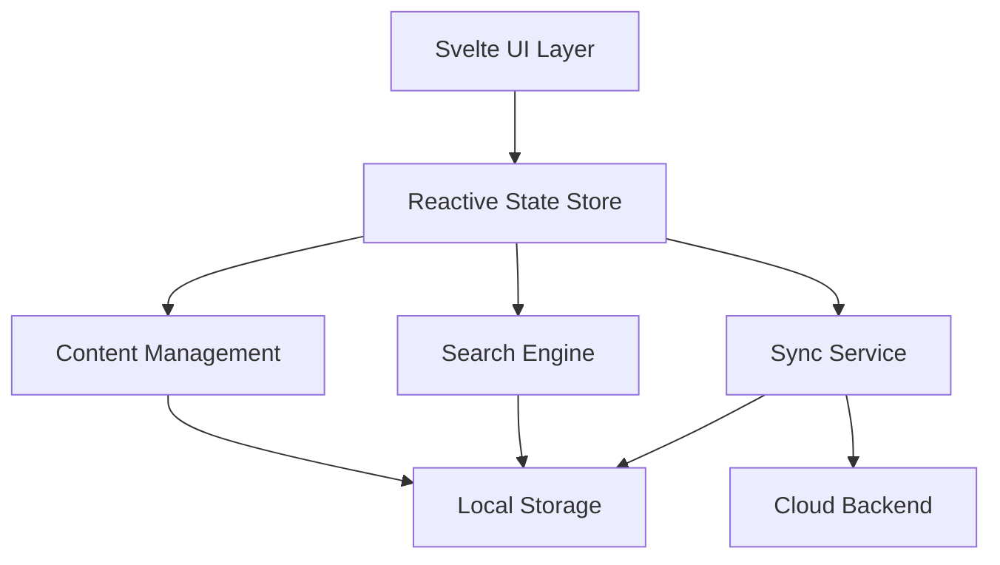

# Design Document

## Overview

The Interactive Knowledge Management System will be built as a modern web application using Svelte 5 with its new runes-based reactivity system. The architecture follows a local-first approach with optional cloud synchronization, ensuring users maintain control over their data while benefiting from collaborative features when desired.

The system leverages Svelte's compiler-time optimizations for smooth interactions, its reactive state management for real-time updates, and its component-based architecture for modular, reusable learning content blocks.

## Architecture

### High-Level Architecture



### Core Architectural Principles

1. **Local-First**: All data stored locally using IndexedDB with optional cloud sync
2. **Reactive**: Svelte runes (`$state`, `$derived`, `$effect`) for real-time UI updates
3. **Component-Driven**: Modular content blocks that can be composed into learning modules
4. **Progressive Enhancement**: Works offline, enhanced when online
5. **Performance-Focused**: Lazy loading, virtual scrolling, and efficient rendering

## Components and Interfaces

### Core Components

#### 1. Content Editor (`ContentEditor.svelte`)

```typescript
interface ContentBlock {
	id: string;
	type: 'text' | 'image' | 'video' | 'code' | 'quiz' | 'flashcard' | 'diagram';
	content: any;
	metadata: {
		created: Date;
		modified: Date;
		version: number;
	};
}

interface EditorState {
	blocks: ContentBlock[];
	selectedBlock: string | null;
	isEditing: boolean;
	history: ContentBlock[][];
}
```

#### 2. Knowledge Tree (`KnowledgeTree.svelte`)

```typescript
interface KnowledgeNode {
	id: string;
	title: string;
	type: 'folder' | 'module' | 'lesson';
	children?: KnowledgeNode[];
	parent?: string;
	metadata: {
		difficulty: 1 | 2 | 3 | 4 | 5;
		estimatedTime: number;
		prerequisites: string[];
		tags: string[];
	};
	progress?: {
		completed: boolean;
		score?: number;
		lastAccessed: Date;
	};
}
```

#### 3. Interactive Elements

**Quiz Component (`Quiz.svelte`)**

```typescript
interface Question {
	id: string;
	type: 'multiple-choice' | 'true-false' | 'fill-blank' | 'drag-drop';
	question: string;
	options?: string[];
	correctAnswer: any;
	explanation?: string;
}

interface QuizState {
	questions: Question[];
	currentQuestion: number;
	answers: Map<string, any>;
	score: number;
	completed: boolean;
}
```

**Flashcard Component (`Flashcard.svelte`)**

```typescript
interface Flashcard {
	id: string;
	front: string;
	back: string;
	difficulty: number;
	nextReview: Date;
	reviewCount: number;
}
```

#### 4. Search and Discovery (`SearchEngine.svelte`)

```typescript
interface SearchIndex {
	content: Map<string, string[]>; // content_id -> tokenized words
	tags: Map<string, string[]>; // tag -> content_ids
	links: Map<string, string[]>; // content_id -> linked_content_ids
}

interface SearchResult {
	id: string;
	title: string;
	snippet: string;
	relevance: number;
	type: string;
	tags: string[];
}
```

### State Management

Using Svelte 5 runes for reactive state management:

```typescript
// Global application state
export const appState = $state({
	user: {
		id: '',
		preferences: {
			theme: 'light',
			learningStyle: 'visual',
			difficulty: 3
		}
	},
	content: {
		nodes: new Map<string, KnowledgeNode>(),
		currentNode: null,
		searchResults: []
	},
	progress: {
		completedModules: new Set<string>(),
		currentStreak: 0,
		totalTimeSpent: 0
	},
	sync: {
		isOnline: false,
		lastSync: null,
		pendingChanges: []
	}
});

// Derived state for computed values
export const filteredContent = $derived(() => {
	const { nodes, searchQuery } = appState.content;
	if (!searchQuery) return Array.from(nodes.values());

	return Array.from(nodes.values()).filter(
		(node) =>
			node.title.toLowerCase().includes(searchQuery.toLowerCase()) ||
			node.metadata.tags.some((tag) => tag.toLowerCase().includes(searchQuery.toLowerCase()))
	);
});

// Effects for side effects
$effect(() => {
	// Auto-save when content changes
	if (appState.content.currentNode) {
		saveToLocalStorage(appState.content.currentNode);
	}
});
```

## Data Models

### Content Storage Schema

```typescript
interface ContentModule {
	id: string;
	title: string;
	description: string;
	blocks: ContentBlock[];
	metadata: {
		author: string;
		created: Date;
		modified: Date;
		version: number;
		difficulty: number;
		estimatedTime: number;
		prerequisites: string[];
		tags: string[];
		language: string;
	};
	relationships: {
		prerequisites: string[];
		dependents: string[];
		related: string[];
	};
	analytics: {
		views: number;
		completions: number;
		averageScore: number;
		averageTime: number;
	};
}

interface UserProgress {
	userId: string;
	moduleId: string;
	status: 'not-started' | 'in-progress' | 'completed';
	score?: number;
	timeSpent: number;
	lastAccessed: Date;
	attempts: number;
	bookmarked: boolean;
	notes: string;
}

interface LearningPath {
	id: string;
	name: string;
	description: string;
	modules: string[];
	estimatedDuration: number;
	difficulty: number;
	prerequisites: string[];
}
```

### Local Storage Implementation

Using IndexedDB for efficient local storage:

```typescript
interface DatabaseSchema {
	modules: ContentModule;
	progress: UserProgress;
	paths: LearningPath;
	settings: UserSettings;
	cache: {
		searchIndex: SearchIndex;
		recommendations: Recommendation[];
	};
}
```

## Error Handling

### Error Types and Handling Strategy

1. **Content Loading Errors**

   - Graceful degradation with placeholder content
   - Retry mechanisms with exponential backoff
   - Offline fallback to cached content

2. **Sync Conflicts**

   - Three-way merge for content conflicts
   - User-guided resolution for complex conflicts
   - Automatic resolution for non-conflicting changes

3. **Storage Quota Exceeded**

   - Intelligent cache cleanup based on usage patterns
   - User notification with storage management options
   - Compression for older content

4. **Network Failures**
   - Queue operations for later sync
   - Optimistic UI updates with rollback capability
   - Clear offline/online status indicators

### Error Recovery Components

```typescript
// Error boundary component
export class ErrorBoundary {
	error = $state<Error | null>(null);

	catch(error: Error) {
		this.error = error;
		logError(error);
		showUserFriendlyMessage(error);
	}

	retry() {
		this.error = null;
	}
}
```

## Testing Strategy

### Unit Testing

- **Component Testing**: Test individual Svelte components in isolation
- **State Management**: Test reactive state updates and derived values
- **Utility Functions**: Test content processing, search algorithms, and data transformations
- **Storage Layer**: Test IndexedDB operations and data persistence

### Integration Testing

- **User Workflows**: Test complete user journeys from content creation to consumption
- **Sync Operations**: Test data synchronization between local and cloud storage
- **Cross-Component Communication**: Test component interactions and state sharing

### End-to-End Testing

- **Learning Scenarios**: Test complete learning paths and progress tracking
- **Collaborative Features**: Test content sharing and collaborative editing
- **Performance**: Test with large datasets and complex content structures

### Testing Tools and Framework

- **Vitest**: For unit and integration testing
- **Playwright**: For end-to-end browser testing
- **Testing Library**: For component testing with user-centric approach
- **MSW (Mock Service Worker)**: For API mocking during tests

### Performance Testing

- **Bundle Size**: Monitor and optimize JavaScript bundle sizes
- **Runtime Performance**: Test rendering performance with large content sets
- **Memory Usage**: Test for memory leaks in long-running sessions
- **Offline Performance**: Test application performance without network connectivity

## Implementation Phases

### Phase 1: Core Foundation

- Basic content editor with text and media support
- Local storage implementation with IndexedDB
- Simple knowledge tree navigation
- Basic progress tracking

### Phase 2: Interactive Elements

- Quiz and flashcard components
- Interactive diagrams and code execution
- Search functionality with full-text indexing
- Spaced repetition system

### Phase 3: Advanced Features

- Collaborative editing and sharing
- Advanced analytics and recommendations
- Cloud synchronization
- Import/export capabilities

### Phase 4: Optimization and Polish

- Performance optimizations
- Advanced accessibility features
- Mobile responsiveness
- Comprehensive testing coverage
