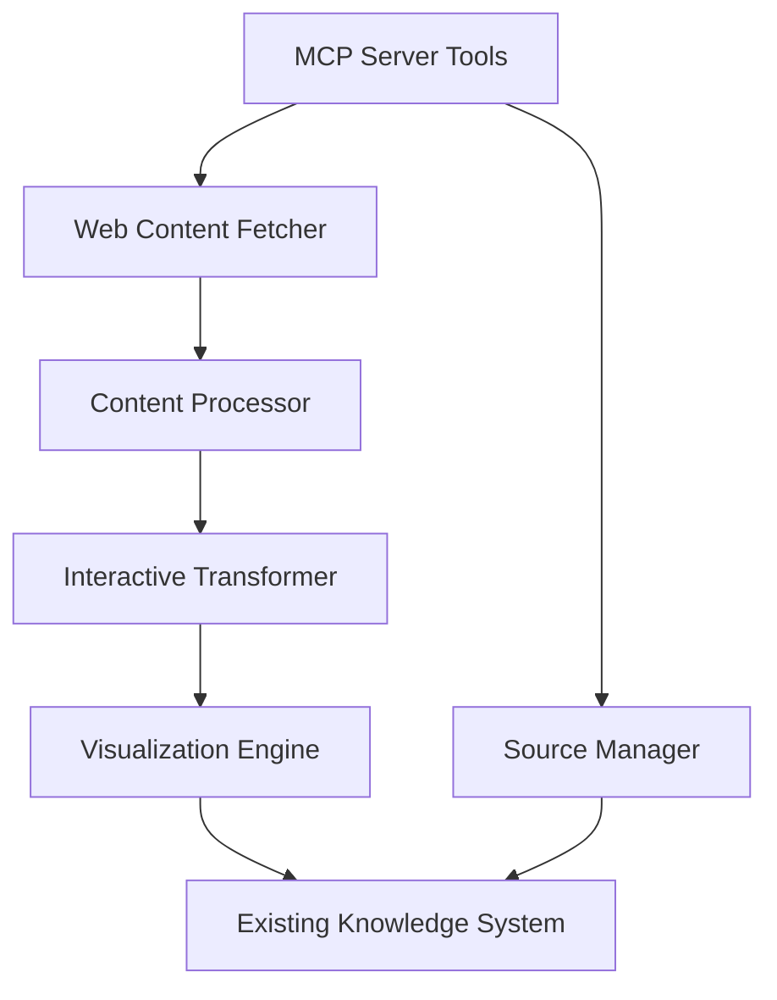

# Design Document

## Overview

The Web Content Sourcing and Transformation System will extend the existing Interactive Knowledge System with powerful capabilities for discovering, importing, and transforming web content into rich interactive learning materials. The system leverages MCP (Model Context Protocol) server architecture to provide automated content processing tools while maintaining the local-first approach of the existing system.

The design emphasizes intelligent content transformation that goes beyond simple text extraction to create dynamic, interactive visualizations and simulations from static web content. This includes converting charts into interactive data explorers, diagrams into parameter-adjustable simulations, and technical content into hands-on learning experiences.

## Architecture

### High-Level Architecture



### Core Architectural Principles

1. **MCP-First Integration**: All content sourcing operations exposed as MCP tools for automation
2. **Intelligent Transformation**: AI-powered analysis to identify interactive potential in static content
3. **Modular Processing Pipeline**: Extensible system for adding new content extractors and transformers
4. **Visualization-Centric**: Focus on creating interactive, explorable content rather than static imports
5. **Source Preservation**: Maintain full traceability and attribution for all imported content

## Components and Interfaces

### Core Components

#### 1. MCP Server (`WebContentMCPServer`)

```typescript
interface MCPServerTools {
	// Content fetching tools
	fetchWebContent: (url: string, options?: FetchOptions) => Promise<WebContent>;
	batchImportUrls: (urls: string[], options?: BatchOptions) => Promise<ImportResult[]>;
	monitorRSSFeed: (feedUrl: string, options?: MonitorOptions) => Promise<void>;

	// Content processing tools
	processContentToInteractive: (
		contentId: string,
		options?: ProcessOptions
	) => Promise<InteractiveContent>;
	generateVisualizations: (
		contentId: string,
		visualizationType?: string
	) => Promise<Visualization[]>;
	createInteractiveSimulation: (contentId: string, domain?: string) => Promise<Simulation>;

	// Source management tools
	listContentSources: (filters?: SourceFilters) => Promise<ContentSource[]>;
	updateSourceContent: (sourceId: string) => Promise<UpdateResult>;
	validateContentQuality: (contentId: string) => Promise<QualityReport>;
}
```

#### 2. Web Content Fetcher (`WebContentFetcher`)

```typescript
interface WebContent {
	id: string;
	url: string;
	title: string;
	content: {
		html: string;
		text: string;
		images: ImageReference[];
		codeBlocks: CodeBlock[];
		tables: TableData[];
		charts: ChartData[];
	};
	metadata: {
		author?: string;
		publishDate?: Date;
		lastModified?: Date;
		domain: string;
		contentType: string;
		language: string;
		readingTime: number;
	};
	extraction: {
		method: 'readability' | 'custom' | 'api';
		confidence: number;
		issues: string[];
	};
}

interface ContentExtractor {
	canHandle(url: string): boolean;
	extract(url: string): Promise<WebContent>;
	getDomain(): string;
}
```

#### 3. Interactive Transformer (`InteractiveTransformer`)

```typescript
interface InteractiveTransformation {
	sourceBlockId: string;
	transformationType:
		| 'visualization'
		| 'simulation'
		| 'interactive-chart'
		| 'parameter-explorer'
		| 'step-by-step';
	confidence: number;
	reasoning: string;
	suggestedInteraction: InteractionSpec;
}

interface InteractionSpec {
	type:
		| 'neural-network'
		| 'chart-explorer'
		| 'algorithm-stepper'
		| 'parameter-adjuster'
		| 'data-filter';
	parameters: {
		[key: string]: {
			type: 'slider' | 'dropdown' | 'toggle' | 'input';
			range?: [number, number];
			options?: string[];
			default: any;
			description: string;
		};
	};
	outputs: {
		[key: string]: {
			type: 'chart' | 'text' | 'image' | 'animation';
			description: string;
		};
	};
}
```

#### 4. Visualization Engine (`VisualizationEngine`)

```typescript
interface VisualizationComponent {
	id: string;
	type:
		| 'interactive-chart'
		| 'neural-network-sim'
		| 'algorithm-viz'
		| 'data-explorer'
		| 'system-diagram';
	config: VisualizationConfig;
	data: any;
	interactions: InteractionHandler[];
}

interface VisualizationConfig {
	title: string;
	description: string;
	parameters: Parameter[];
	layout: LayoutConfig;
	styling: StyleConfig;
	animations: AnimationConfig;
}

interface InteractionHandler {
	event: string;
	parameter: string;
	effect: (value: any, state: any) => any;
	debounce?: number;
}
```

#### 5. Source Manager (`SourceManager`)

```typescript
interface ContentSource {
	id: string;
	url: string;
	title: string;
	domain: string;
	importDate: Date;
	lastChecked: Date;
	status: 'active' | 'updated' | 'error' | 'removed';
	metadata: SourceMetadata;
	content: {
		original: WebContent;
		processed: ContentModule;
		interactive: InteractiveContent;
	};
	usage: {
		timesReferenced: number;
		lastAccessed: Date;
		generatedModules: string[];
	};
}

interface SourceMetadata {
	author?: string;
	license?: string;
	attribution: string;
	tags: string[];
	category: string;
	quality: QualityMetrics;
}
```

### Extended Content Block Types

Building on the existing ContentBlock interface, we add new interactive types:

```typescript
interface InteractiveVisualizationBlock extends ContentBlock {
	type: 'interactive-visualization';
	content: {
		visualizationType: 'neural-network' | 'chart' | 'simulation' | 'algorithm' | 'data-explorer';
		config: VisualizationConfig;
		data: any;
		sourceReference: {
			originalUrl: string;
			originalContent: string;
			transformationReasoning: string;
		};
	};
}

interface InteractiveChartBlock extends ContentBlock {
	type: 'interactive-chart';
	content: {
		chartType: 'line' | 'bar' | 'scatter' | 'heatmap' | 'network';
		data: ChartData;
		interactions: ChartInteraction[];
		filters: DataFilter[];
		sourceReference: SourceReference;
	};
}

interface SimulationBlock extends ContentBlock {
	type: 'simulation';
	content: {
		simulationType: string;
		parameters: SimulationParameter[];
		initialState: any;
		stepFunction: string; // Serialized function
		visualization: VisualizationSpec;
		sourceReference: SourceReference;
	};
}
```

## Data Models

### Content Processing Pipeline

```typescript
interface ProcessingPipeline {
	stages: ProcessingStage[];
	currentStage: number;
	status: 'pending' | 'processing' | 'completed' | 'error';
	results: ProcessingResult[];
}

interface ProcessingStage {
	name: string;
	processor: string;
	config: any;
	dependencies: string[];
	outputs: string[];
}

interface ProcessingResult {
	stage: string;
	success: boolean;
	data: any;
	metadata: {
		processingTime: number;
		confidence: number;
		issues: string[];
	};
}
```

### Interactive Content Database Schema

```typescript
interface InteractiveContentDB {
	sources: ContentSource;
	transformations: InteractiveTransformation;
	visualizations: VisualizationComponent;
	simulations: SimulationBlock;
	processingJobs: ProcessingPipeline;
	qualityMetrics: QualityReport;
}

interface QualityReport {
	contentId: string;
	scores: {
		readability: number;
		interactivity: number;
		accuracy: number;
		engagement: number;
	};
	suggestions: QualityImprovement[];
	lastAssessed: Date;
}
```

## MCP Server Implementation

### Tool Definitions

```typescript
const mcpTools = {
	// Primary content fetching
	'fetch-web-content': {
		description: 'Fetch and extract content from a web URL',
		parameters: {
			url: { type: 'string', required: true },
			extractorType: { type: 'string', enum: ['auto', 'readability', 'custom'] },
			includeImages: { type: 'boolean', default: true },
			generateInteractive: { type: 'boolean', default: true }
		}
	},

	// Batch operations
	'batch-import-urls': {
		description: 'Import multiple URLs in batch with processing',
		parameters: {
			urls: { type: 'array', items: { type: 'string' } },
			processingOptions: { type: 'object' },
			priority: { type: 'string', enum: ['low', 'normal', 'high'] }
		}
	},

	// Interactive transformation
	'transform-to-interactive': {
		description: 'Transform static content into interactive visualizations',
		parameters: {
			contentId: { type: 'string', required: true },
			transformationType: {
				type: 'string',
				enum: ['auto', 'visualization', 'simulation', 'chart']
			},
			domain: { type: 'string' }, // e.g., "machine-learning", "finance", "physics"
			parameters: { type: 'object' }
		}
	},

	// Visualization generation
	'generate-visualization': {
		description: 'Generate interactive visualization from content',
		parameters: {
			contentId: { type: 'string', required: true },
			visualizationType: { type: 'string' },
			customConfig: { type: 'object' }
		}
	},

	// Source management
	'manage-content-sources': {
		description: 'Manage imported content sources',
		parameters: {
			action: { type: 'string', enum: ['list', 'update', 'remove', 'validate'] },
			sourceId: { type: 'string' },
			filters: { type: 'object' }
		}
	}
};
```

### Processing Workflows

```typescript
interface ContentProcessingWorkflow {
	// Stage 1: Fetch and Extract
	fetch: (url: string) => Promise<WebContent>;

	// Stage 2: Analyze for Interactive Potential
	analyze: (content: WebContent) => Promise<InteractiveOpportunity[]>;

	// Stage 3: Transform Static to Interactive
	transform: (
		content: WebContent,
		opportunities: InteractiveOpportunity[]
	) => Promise<InteractiveContent>;

	// Stage 4: Generate Visualizations
	visualize: (interactiveContent: InteractiveContent) => Promise<VisualizationComponent[]>;

	// Stage 5: Integrate with Knowledge System
	integrate: (visualizations: VisualizationComponent[]) => Promise<ContentModule>;
}
```

## Error Handling

### Content Processing Errors

1. **Fetch Failures**

   - Network timeouts with exponential backoff retry
   - Rate limiting compliance with respectful delays
   - Fallback to cached content when available

2. **Extraction Errors**

   - Multiple extractor fallbacks (readability → custom → manual)
   - Partial content recovery with user notification
   - Quality validation with confidence scoring

3. **Transformation Failures**

   - Graceful degradation to static content blocks
   - Alternative visualization suggestions
   - Manual override options for complex content

4. **Integration Conflicts**
   - Duplicate content detection and merging
   - Relationship conflict resolution
   - Version control for updated source content

## Testing Strategy

### Unit Testing

- **Content Extractors**: Test extraction accuracy across different websites
- **Interactive Transformers**: Test transformation logic and confidence scoring
- **Visualization Components**: Test parameter handling and rendering
- **MCP Tools**: Test all server tools with various input scenarios

### Integration Testing

- **End-to-End Workflows**: Test complete import-to-interactive pipelines
- **Knowledge System Integration**: Test seamless integration with existing components
- **Batch Processing**: Test performance with multiple concurrent imports
- **Error Recovery**: Test graceful handling of various failure scenarios

### Performance Testing

- **Large Content Processing**: Test with long articles and complex visualizations
- **Concurrent Operations**: Test multiple simultaneous imports and transformations
- **Memory Usage**: Test for memory leaks during long-running operations
- **Visualization Rendering**: Test interactive component performance

## Implementation Phases

### Phase 1: Core Infrastructure

- Basic web content fetching and extraction
- MCP server setup with essential tools
- Integration with existing knowledge system
- Simple static-to-interactive transformations

### Phase 2: Interactive Transformations

- Advanced content analysis for interactive opportunities
- Domain-specific transformation engines
- Interactive visualization components
- Parameter-based simulations

### Phase 3: Advanced Features

- Batch processing and monitoring
- Quality assessment and improvement suggestions
- Advanced visualization types (neural networks, algorithms, etc.)
- Collaborative source management

### Phase 4: Optimization and Polish

- Performance optimizations for large-scale processing
- Advanced error handling and recovery
- Comprehensive testing and validation
- User experience enhancements
