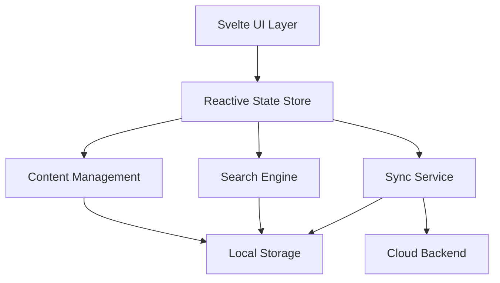

# Interactive Knowledge System

The goal of this project is to provide a powerful, flexible, and offline-first tool for personal knowledge management and learning.

Interactive Knowledge System is a local-first platform for exploring, organizing, and transforming knowledge. It combines Svelte 5's reactivity with rich visualization components, a robust service layer, and Model Context Protocol (MCP) tools for working with external content.

## Core Concepts

This platform is built on a set of core principles that guide its architecture and development. Understanding these concepts is key to contributing effectively.

### Local-First Architecture

The system is designed to be **local-first**, meaning your data is stored primarily on your own device. This ensures that you have full ownership of your knowledge, the application is fast, and it works perfectly offline. Cloud synchronization is an optional layer for backup and collaboration, not a requirement.

### Component-Driven Content

Instead of monolithic documents, knowledge is organized into modular, reusable **content blocks**. These blocks can be anything from a simple paragraph of text to a complex, interactive chart or a quiz. This component-driven approach, powered by Svelte, makes content creation flexible and powerful.

### Reactive State Management

The user interface is highly interactive and stays in sync with the underlying data thanks to Svelte 5's **runes-based reactivity**. This modern, fine-grained reactivity model allows for declarative and efficient state management, making the application both powerful and easy to reason about.

## Table of Contents

- [Core Concepts](#core-concepts)
- [Features](#features)
- [Getting Started](#getting-started)
  - [Prerequisites](#prerequisites)
  - [Installation](#installation)
  - [Development Commands](#development-commands)
- [Architecture Overview](#architecture-overview)
- [Project Structure](#project-structure)
- [Key Components & Usage](#key-components--usage)
- [Data Models](#data-models)
- [State Management with Svelte Runes](#state-management-with-svelte-runes)
- [Demo Routes](#demo-routes)
- [Contributing](#contributing)
- [Roadmap](#roadmap)
- [License](#license)

## Features

- **Type-safe content model** – Comprehensive TypeScript types for content blocks, modules, knowledge trees, users, and interactive elements.
- **Runes-based state management** – Reactive global state with derived values, effects, and persistence helpers.
- **Local storage layer** – IndexedDB-backed storage for content, relationships, user data, and media assets.
- **Service layer** – Modular services for network access, synchronization, conflict resolution, content analysis, and offline queueing.
- **Component library** – Svelte components for knowledge maps, progress dashboards, interactive charts, simulations, editors, and more.
- **MCP integration** – Tools and server for processing web content using the Model Context Protocol.
- **Demo routes** – Example pages showcasing progress tracking, relationship management, simulations, code editing, and interactive visualizations.

## Getting Started

### Prerequisites

- Node.js 18+
- pnpm (recommended) or npm

### Installation

```bash
pnpm install
# or
npm install
```

### Development Commands

```bash
pnpm dev        # Start development server
pnpm test       # Run unit tests with Vitest
pnpm lint       # Prettier & ESLint checks
pnpm build      # Production build
pnpm preview    # Preview production build
```

## Architecture Overview

The system is designed with a layered architecture to separate concerns and enhance maintainability. At a high level, the flow of data is from the UI, through the reactive state store, down to the service and storage layers.



The main layers are:

- **Svelte UI Layer:** The top-level layer, composed of Svelte 5 components that provide the user interface.
- **Reactive State Store:** A centralized store built with Svelte Runes that holds the application state and business logic. The UI reactively updates based on changes in this store.
- **Services:** A layer of modular services that handle specific domains like content management, search, and synchronization. You can find these in [`src/lib/services`](src/lib/services).
- **Local Storage:** The persistence layer, which uses IndexedDB to store all user data locally in the browser. See [`src/lib/storage`](src/lib/storage) for the implementation.
- **Cloud Backend:** An optional layer that the Sync Service can connect to for data backup and collaboration features.

## Project Structure

```
interactive-knowledge-system/
├── src/
│   ├── lib/
│   │   ├── components/   # UI components and visualization blocks
│   │   ├── mcp/          # Model Context Protocol tools and server
│   │   ├── services/     # Data processing, sync, and analysis services
│   │   ├── storage/      # IndexedDB adapters and storage helpers
│   │   ├── stores/       # Global state, effects, and persistence
│   │   ├── styles/       # Shared styles and themes
│   │   ├── types/        # TypeScript interfaces and type exports
│   │   └── utils/        # Helper utilities (export, import, logging, etc.)
│   ├── routes/           # SvelteKit routes and demo pages
│   └── app.html          # HTML template
├── package.json          # Dependencies and scripts
├── svelte.config.js      # Svelte configuration
├── tsconfig.json         # TypeScript configuration
├── vite.config.ts        # Vite build configuration
└── README.md             # Project documentation
```

## Key Components & Usage

This project includes a rich library of Svelte components. Below are some of the key components and how to use them.

### 1. KnowledgeTree

The `KnowledgeTree` component is used to display and manage a hierarchical structure of knowledge nodes.

**Props Interface:**

```typescript
interface Props {
  nodes?: KnowledgeNode[];
  showActions?: boolean;
  onNodeSelect?: (node: KnowledgeNode) => void;
  onNodeAdd?: (parentId: string | null) => void;
  onNodeDelete?: (nodeId: string) => void;
  onNodeMove?: (nodeId: string, newParentId: string | null) => void;
}
```

**Usage Example:**

```svelte
<script>
  import { KnowledgeTree } from '$lib/components';
  import type { KnowledgeNode } from '$lib/types/knowledge';

  let sampleNodes: KnowledgeNode[] = [
    {
      id: '1',
      title: 'Introduction to Svelte',
      type: 'module',
      children: [
        { id: '2', title: 'Components', type: 'lesson' },
        { id: '3', title: 'Reactivity', type: 'lesson' }
      ],
      metadata: { difficulty: 2, estimatedTime: 30, prerequisites: [], tags: ['Svelte'] }
    }
  ];
</script>

<KnowledgeTree nodes={sampleNodes} />
```

### 2. InteractiveChart

The `InteractiveChart` component renders interactive and zoomable charts.

**Props Interface:**

```typescript
export let data: any;
export let config: VisualizationConfig;
```

**Usage Example:**

```svelte
<script>
  import { InteractiveChart } from '$lib/components';
  import type { VisualizationConfig } from '$lib/types/web-content';

  let chartData = [
    { x: 0, y: 5 },
    { x: 1, y: 9 },
    { x: 2, y: 7 },
    { x: 3, y: 8 }
  ];

  let chartConfig: VisualizationConfig = {
    title: 'My First Chart',
    description: 'A simple line chart.',
    layout: {
      width: 600,
      height: 400,
      margin: { top: 20, right: 20, bottom: 40, left: 40 },
      responsive: true
    }
  };
</script>

<InteractiveChart data={chartData} config={chartConfig} />
```

### 3. ContentEditor

The `ContentEditor` provides a WYSIWYG-like experience for creating and managing content blocks.

**Props Interface:**

```typescript
interface Props {
  initialBlocks?: ContentBlock[];
  onSave?: (blocks: ContentBlock[]) => void;
  autoSave?: boolean;
  autoSaveDelay?: number;
}
```

**Usage Example:**

```svelte
<script>
  import { ContentEditor } from '$lib/components';
  import type { ContentBlock } from '$lib/types/content';

  let blocks: ContentBlock[] = [
    {
      id: '1',
      type: 'text',
      content: { html: '<p>This is the first paragraph.</p>' },
      metadata: { created: new Date(), modified: new Date(), version: 1 }
    }
  ];

  function handleSave(updatedBlocks: ContentBlock[]) {
    console.log('Content saved:', updatedBlocks);
  }
</script>

<ContentEditor initialBlocks={blocks} onSave={handleSave} />
```

## Data Models

The project is built around a set of core data structures that represent knowledge and content. Understanding these models is essential for development.

### KnowledgeNode

A `KnowledgeNode` represents an item in the knowledge hierarchy, such as a folder, a module, or a lesson.

```typescript
export interface KnowledgeNode {
  id: string;
  title: string;
  type: 'folder' | 'module' | 'lesson';
  children?: KnowledgeNode[];
  parent?: string;
  metadata: {
    difficulty: 1 | 2 | 3 | 4 | 5;
    estimatedTime: number;
    prerequisites: string[];
    tags: string[];
  };
  progress?: {
    completed: boolean;
    score?: number;
    lastAccessed: Date;
  };
}
```

### ContentModule

A `ContentModule` is a collection of `ContentBlock`s that make up a piece of learning content.

```typescript
export interface ContentModule {
  id: string;
  title: string;
  description: string;
  blocks: ContentBlock[];
  metadata: {
    author: string;
    created: Date;
    modified: Date;
    version: number;
    difficulty: number;
    estimatedTime: number;
    prerequisites: string[];
    tags: string[];
    language: string;
  };
  relationships: {
    prerequisites: string[];
    dependents: string[];
    related: string[];
  };
  analytics: {
    views: number;
    completions: number;
    averageScore: number;
    averageTime: number;
  };
}
```

## State Management with Svelte Runes

The application uses Svelte 5's new reactivity model, called **Runes**, for state management. This allows for a more direct and declarative way to handle reactive state, making the code easier to understand and maintain. The global state is located in `src/lib/stores`.

The core runes used are:

- `$state`: Declares a reactive state variable.
- `$derived`: Creates a computed value that depends on other state variables.
- `$effect`: Triggers side effects (like logging or saving to local storage) when state variables change.

Here is a simplified example of how they are used in this project:

```typescript
import { $state, $derived, $effect } from 'svelte/reactivity';

// Global application state, defined in a .svelte.js file
export const appState = $state({
  user: { name: 'Guest' },
  nodes: new Map<string, KnowledgeNode>(),
  currentNode: null,
  searchQuery: ''
});

// Derived state for computed values
export const filteredNodes = $derived(() => {
  const { nodes, searchQuery } = appState;
  if (!searchQuery) return Array.from(nodes.values());

  return Array.from(nodes.values()).filter(node =>
    node.title.toLowerCase().includes(searchQuery.toLowerCase())
  );
});

// Effects for side effects
$effect(() => {
  // Auto-save the current node when it changes
  if (appState.currentNode) {
    console.log('Saving node:', appState.currentNode.title);
    // In a real scenario, this would call a save function
    // saveToLocalStorage(appState.currentNode);
  }
});
```

## Demo Routes

Several demo pages illustrate system capabilities:

- `/` – Main application shell
- `/knowledge` – Knowledge tree navigation
- `/progress-demo` – Progress tracking dashboard
- `/relationships-demo` – Relationship management
- `/simulation-demo` – Interactive simulation components
- `/code-demo` – Code editor and execution demo
- `/demo-interactive-viz` – Interactive visualization showcase

## Contributing

1. Fork the repository
2. Create a feature branch
3. Make your changes and add tests when applicable
4. Run `pnpm lint` and `pnpm test`
5. Submit a pull request

## Roadmap

- Advanced visualization types (neural networks, system diagrams)
- Content editing and authoring tools
- Enhanced search and discovery
- Collaborative features and cloud sync
- Data export/import workflows

## License

This project is licensed under the MIT License. See `LICENSE` for details.
